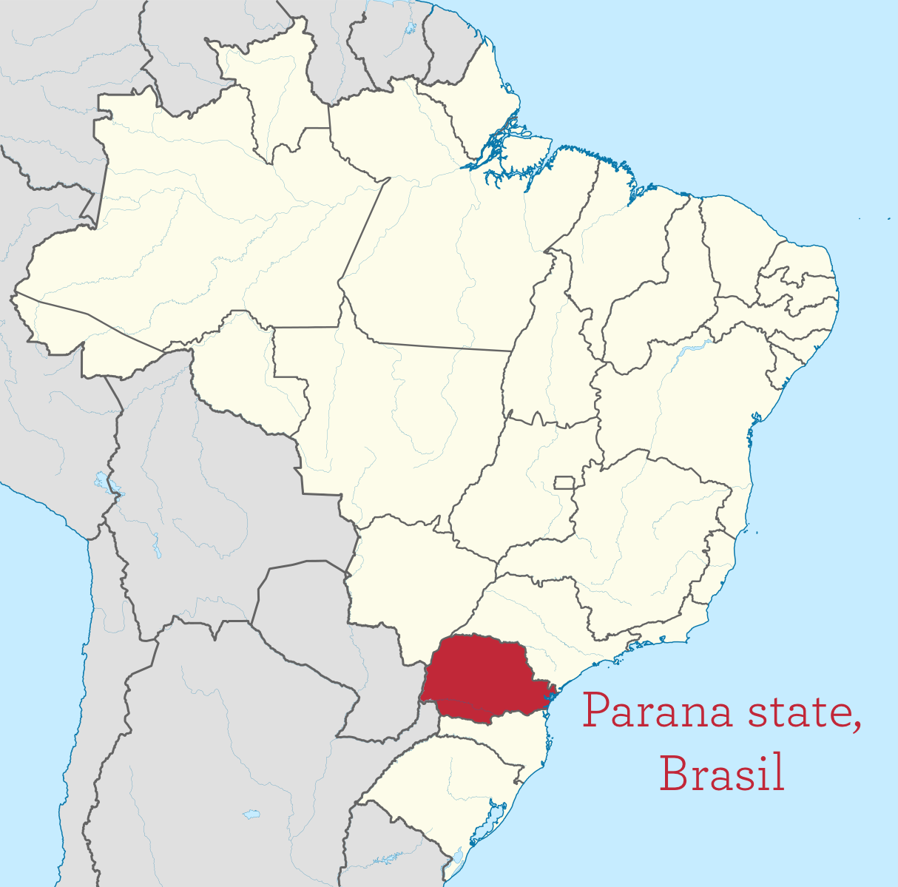

# Plotting Spatial Data

<br>

We are going to use the `geoR` library in R to look at an example of geostatistical data.  

```{r library, warning=FALSE,message=FALSE, eval = FALSE}
library(geoR) 
```
 
The data we will look at corresponds to average rainfall over different years for the period May-June (dry-season). It was collected at 143 recording stations throughout Parana State, Brasil. 

```{r graphic2, echo = FALSE, out.width = "60%", fig.cap = "Parana is one of the 26 states of Brazil, located in the South of the country. Image source: Wikipedia."}

```

<br>

First we need to load the data (which is stored within the `geoR` library in this case).

```{r loadparana, eval = FALSE}
data(parana) 
# rainfall measurements are stored in parana$data
parana$data
# location coordinates are stored in parana$coords
parana$coords
```

First we are going to plot the sampling locations. To get the proportions right for our plot we need to first ensure the plotting region is **square**. 

```{r squareplot, eval = FALSE}
par(pty="s")
plot(parana$coords) 
```

To look at the rainfall at each of the locations we can use the plot function. This produces a set of four plots describing the pattern of the data over space.  

```{r plotparana, eval = FALSE}
plot(parana)
```

<br>

**Which of the following sentences best describes the pattern of rain across the space?**

```{r, echo = FALSE}
q_geor <- sample(c(
    answer = "Higher rain in the south west than in the north east",
    "Higher rain in the east than in the west",
    "Linear decreasing trend from north to south"
)
)
```

`r longmcq(q_geor)`

<br>

We can see from the top left plot that there is higher rain in the south west than in the north east.

<br>
