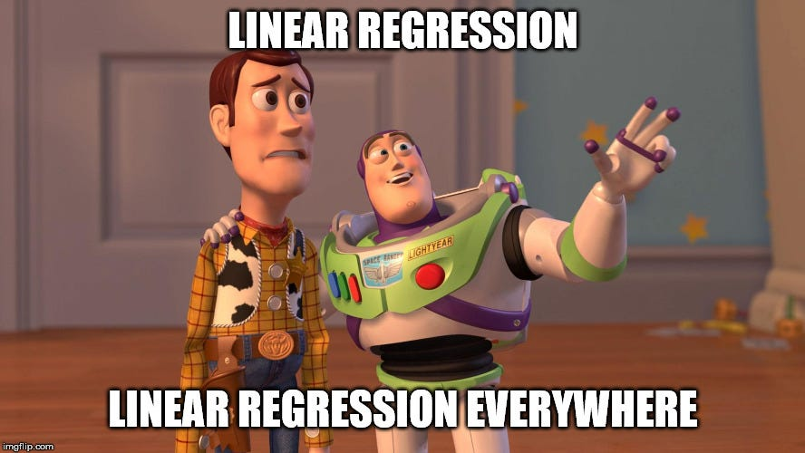

```{r, include = FALSE}
knitr::opts_chunk$set(echo = TRUE, warning = FALSE, message = FALSE)
library(webexercises)
library(tinytex)
library(dplyr)
library(knitr)
library(ggplot2)
library(tidyverse)
library(openintro)
library(infer)
#HeartDisease <- read.csv("HeartDisease.csv")
#HEARTDISEASE <- HeartDisease[,c(1,2,3,5,9,11,16)]
#write.csv(HEARTDISEASE,file="C:/Users/mr340t/OneDrive - University of Glasgow/GTA work/S1Z/LogisticRegressionLabWorking/LogisticRegressionLab/HEARTDISEASE.csv")

HEARTDISEASE <- read.csv("HeartDisease.csv")
#HEARTDISEASE <- na.omit(HEARTDISEASE)


#Diabetes <- read.csv("diabetes.csv")
#DIABETES <- Diabetes[,c(1,2,3,7,8,9)]
#write.csv(DIABETES,file="C:/Users/mr340t/OneDrive - University of Glasgow/GTA work/S1Z/LogisticRegressionLabWorking/LogisticRegressionLab/DIABETES.csv")


DIABETES <- read.csv("diabetes.csv")
#DIABETES <- na.omit(DIABETES)

```


```{r include=FALSE, echo=FALSE}
knitr::write_bib(c(
  .packages(), 'bookdown', 'knitr', 'rmarkdown'
), 'packages.bib')
```

# Welcome to S1Z Lab 5 - Logistic Regression

```{r, echo = FALSE, out.width = "80%", fig.cap = ""}

```

## Intended Learning Outcomes:

* Build a logistic regression model for the risk of heart disease.
* Interpret the coefficients of this model
* Calculate the odds and probabilities of heart disease risk from this model


## An Introdution to Logistic Regression Modeling 

This lab will explore the concept of modelling data using logistic regression. Logistic regression is a type of Generalized Linear Model (GLM) which allows us to build models when there is a categorical response variable with two levels, e.g. yes and no.

The key idea behind this is to attempt to explore a relationship between a:

* Binary response variable \(Y_i\), and
* Explanatory/predictor variables \(x_i\).

<br>

To model a binary response, we use the Logit Function which is the log-odds of \(p_i\) (the probability of "success" for outcome \(i\)) to transform our response variable. This gives the formula for a logistic regression model as:

\[\boxed{g(p)=log(\frac{p_i}{1-p_i})=\beta_0+\beta_1x_{1i}+...+\beta_kx_{ki}}\]

<br>

Once fit well, we can use these models for predictions of the response variable and find the odds of \(p_i\):

\[\frac{p_i}{1-p_i}=exp(\beta_0+\beta_1x_{1i}+...+\beta_kx_{ki})\]


and/or \(p_i\) itself:

\[p_i=\frac{exp(\beta_0+\beta_1x_{1i}+...+\beta_kx_{ki})}{1+exp(\beta_0+\beta_1x_{1i}+...+\beta_kx_{ki})}\]

