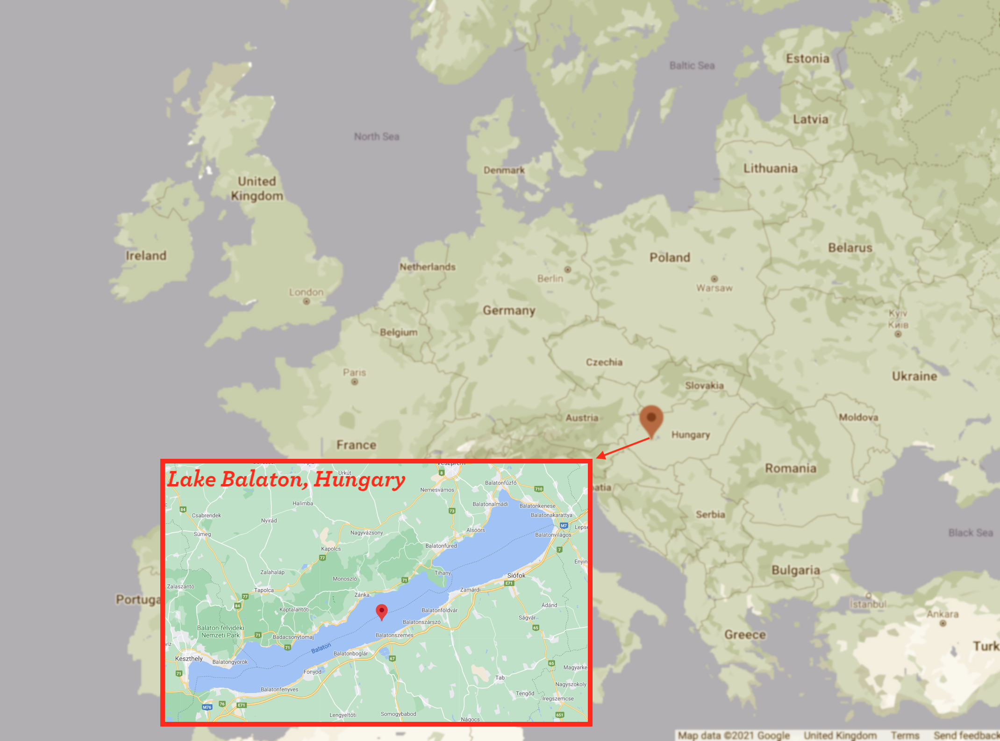

```{r setup, include = FALSE}
library(webexercises)
library(tinytex)
library(dplyr)
library(knitr)
library(ggplot2)
library(tidyverse)
library(openintro)
library(infer)
library(gridExtra)
library(HistData)
library(GGally)
library(broom)
knitr::opts_chunk$set(echo = TRUE)

balaton <- read.csv("LakeBalaton.csv") 
mydat <- read.csv("mydat.csv")

knitr::opts_chunk$set(comment = NA)

year   <- balaton[,1] 
month  <- balaton[,2] 
lswt   <- balaton[,4]

dec.date <- year + (month-1)/12

# fit linear model and calculate res/stres/fits
model1 <- lm(lswt ~ dec.date + sin((2*pi*month)/12)+ cos((2*pi*month)/12))
res <- residuals(model1) 
stres <- rstandard(model1) 
fits <- fitted(model1) 

# fit model2
model2 <- lm(lswt ~ sin((2*pi*month)/12) + cos((2*pi*month)/12)) 
res2 <- residuals(model2) 
stres2 <- rstandard(model2)
fits2 <- fitted(model2) 

# differencing
diff12 <- diff(lswt, 12) 

# Spatial data example
library(geoR)
data(parana) 
```

```{r eval=FALSE, echo=FALSE}
install.packages("bookdown")
```

```{r include=FALSE, echo=FALSE}
knitr::write_bib(c(
  .packages(), 'bookdown', 'knitr', 'rmarkdown'
), 'packages.bib')
```

# Welcome to Lab 5

## Learning Outcomes  

By the end of this computer lab you should be able to:

* Use R to produce plots of report quality.
* Use R to produce autocorrelation function plots. 
* Use R to perform differencing. 
* Interpret R output for linear models to describe linear trends and seasonal patterns.
* Plot and interpret spatial data in R.


## Introduction

In today's lab, we will use `R` to explore temporal patterns in lake surface water temperature (LSWT) at Lake Balaton in Hungary. 

```{r graphic1, echo = FALSE, out.width = "80%", fig.cap = "Balaton lake, in Hungary, is the largest lake in Central Europe with a surface area of 600 km$^2$. Image source: GoogleMaps"}

```

We will work through two examples together and then you can produce a similar set of analyses for an alternative lake as a Group Exercise at the end of the Lab.

## Getting Started

Firstly, make sure you have the `geoR` package installed and loaded in the R environment. 

Next, you should download the dataset `LakeBalaton.csv` from the course Moodle page, and set the working directory to where your dataset is saved. Lake surface water temperature for this lake is available in the `.csv` file `LakeBalaton.csv` now stored into your working directory. To open this data file in `R` you can use the `read.csv` function as shown below. This will assign the data to the object `balaton`.

```{r setwd, eval=FALSE}
install.packages("geoR")

library(geoR) 

# modify this code 
setwd("path to where the LakeBalaton.csv file is!") 

balaton <- read.csv("LakeBalaton.csv")

```
